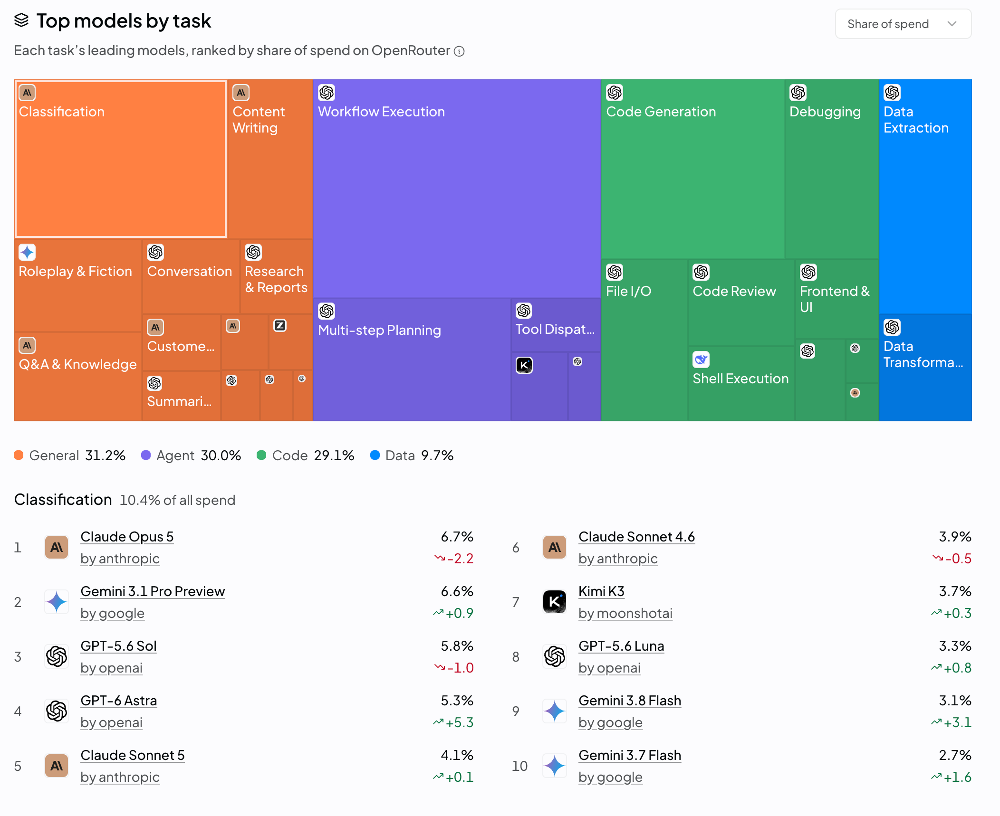
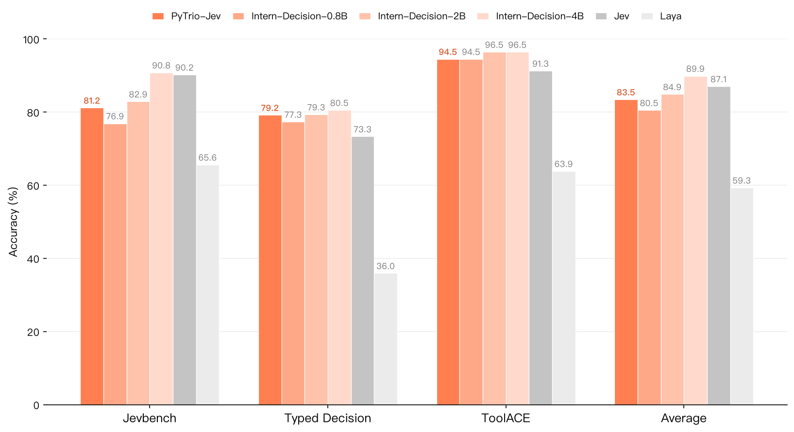
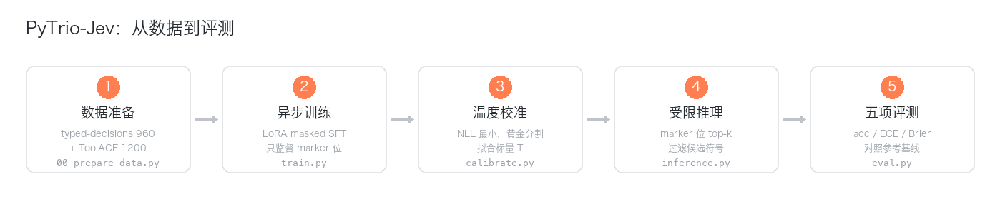
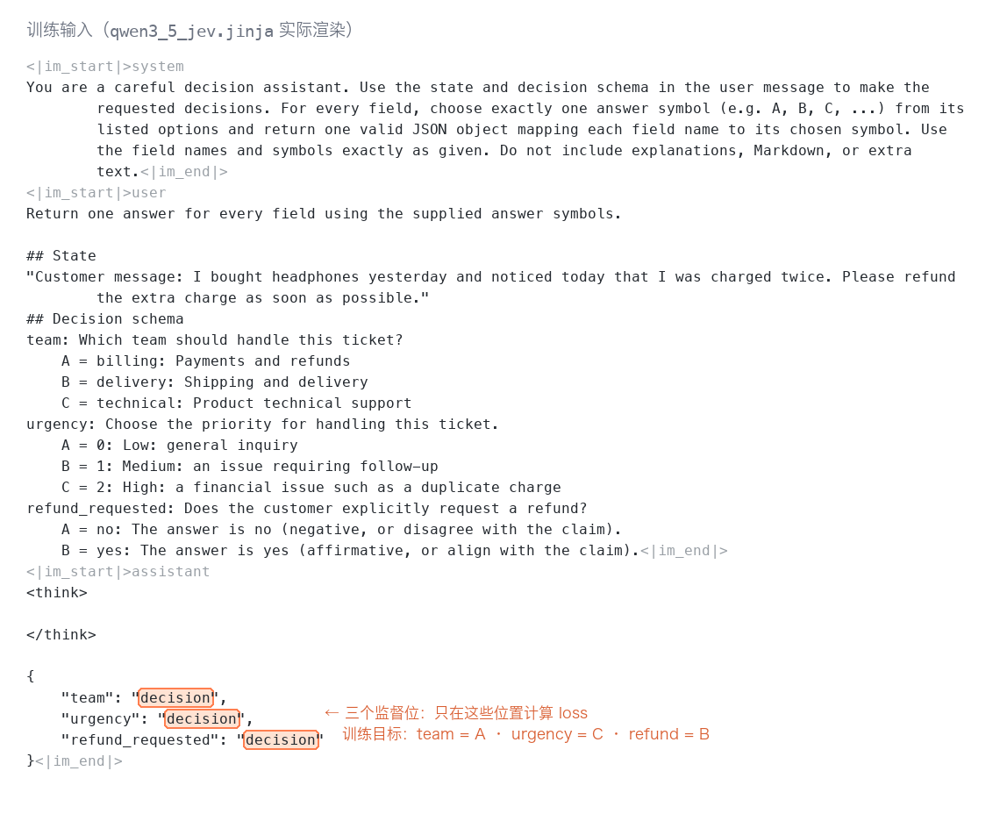
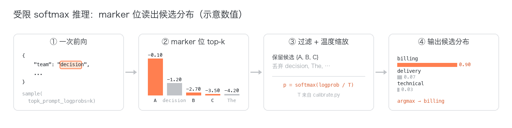
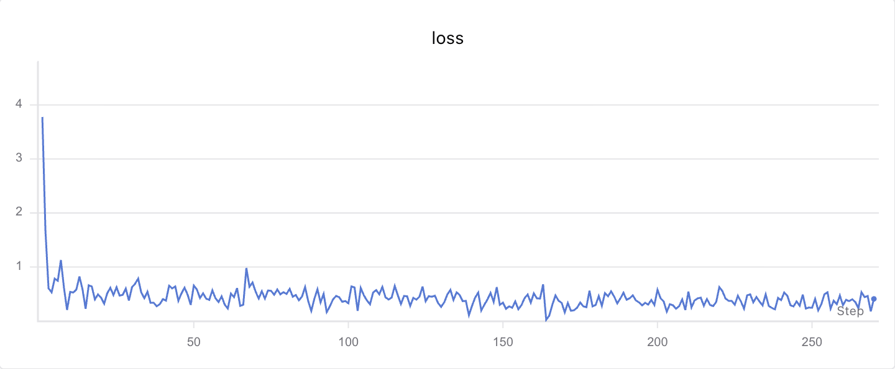
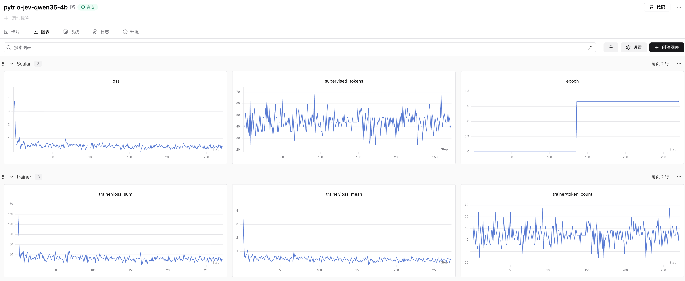
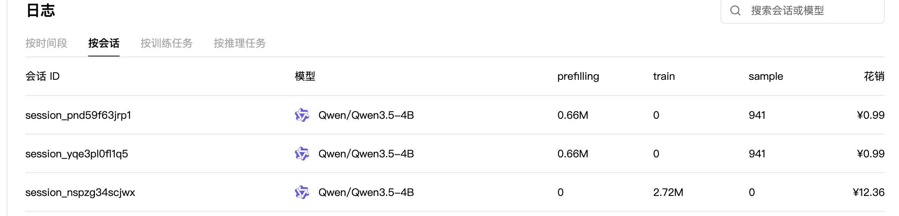
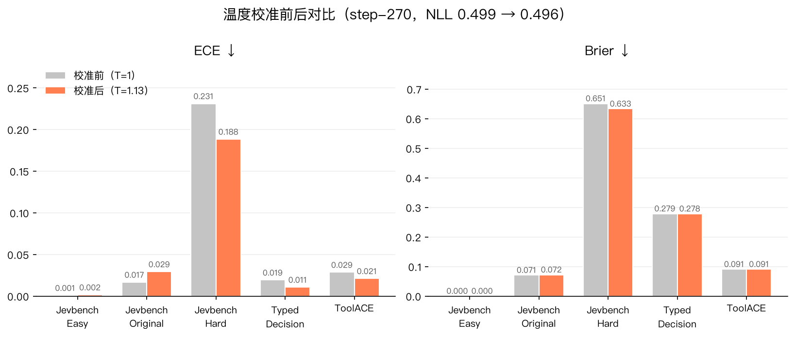

# 第 9.5 篇，一顿麦当劳早餐，人人都可训练自己的 Jev 决策模型！

<div align="center">
  
</div>

<div align="center">
  <a href="https://github.com/KMnO4-zx/agentic-rl-lab/tree/main/09-pytrio-jev"></a>
  <a href="https://huggingface.co/datasets/LocalLLaMA/typed-decisions"></a>
  <a href="https://docs.pytrio.com/docs"></a>
  <a href="https://www.zhihu.com/people/feng-qi-xia-pian"></a>
  <a href="https://www.xiaohongshu.com/user/profile/63c2055e000000002502c58c" target="_blank"></a>
  <a href="https://github.com/KMnO4-zx/agentic-rl-lab"></a>
</div>

> **代码与复现资源**
>
> - 完整代码：[`09-pytrio-jev`](https://github.com/KMnO4-zx/agentic-rl-lab/tree/main/09-pytrio-jev) / 快速启动：[`start.md`](https://github.com/KMnO4-zx/agentic-rl-lab/blob/main/09-pytrio-jev/start.md)
> - 方法参考：[Intern-Decision](https://github.com/InternLM/Intern-Decision)、[Jev 架构逆向](https://archerhume.com/posts/jevs-architecture-unmasked)、[Datawhale AgentJev 教程](https://mp.weixin.qq.com/s/F7i83rn8oDzQ-sg13MKwWA)
> - 训练数据：[`LocalLLaMA/typed-decisions`](https://huggingface.co/datasets/LocalLLaMA/typed-decisions)、[`Team-ACE/ToolACE`](https://huggingface.co/datasets/Team-ACE/ToolACE)
> - SwanLab：[查看本次实验公开的训练记录](https://swanlab.cn/@kmno4/agentic-rl-lab-pytrio-jev/v1/qt5fzd/runs/g4i73a65/chart)
> - PyTRIO：[官网](https://pytrio.com) / [官方文档](https://docs.pytrio.com/docs)

本次训练使用了 2160 条训练数据、2 个 epoch、270 步 LoRA，训练总开销14.34 元人民币，一顿麦当劳早餐。在与 Intern-Decision 完全一致的评测集上，五项平均分从 base 的 76.30 提到 83.74：Typed Decision 和 ToolACE 两项直接超过 Jev，其余大部分逼近 Jev。

## 0. Jev 到底是什么？

网上把 Jev 这类模型讲得有点神乎其神。其实它的本质其实非常朴素：**一个拥有通用世界知识的分类决策模型**。给它一段状态（state）和一组带固定选项的问题（questions），它不理解开放指令、不写小作文，只回答"选 A 还是选 B，各自多大把握"。

但"不神"不等于"没用"。恰恰相反，企业里有大量场景，选项本来就是固定且有限的：

- **意图理解**：售后场景里，用户的诉求就是退款、退货退款、仅退款这三四个选项；
- **工单路由**：这条消息该给账单组、物流组还是技术组；
- **风险分级**：低风险放行、中风险复核、高风险拦截。

这不是我想象出来的需求。OpenRouter 的 "Top models by task" 统计里，**Classification 一个任务就占了全平台 10.4% 的花销**，是 General 类别（31.2%）下最大的单一任务：



很有趣的是榜单上的模型：做分类任务花得最多的模型，是 Claude Opus 5、GPT-6 Astra、Gemini 3.1 Pro 这种最贵的一档。也就是说，大量企业和用户正在真金白银地用昂贵的大模型做分类决策。这是真实场景下的消耗，而这部分需求本来用一个便宜几个数量级的决策模型就能做。

这些场景不需要大模型思前想后写几千字分析，**只需要一个快、稳、概率可信的决策**。让一个通用大模型每次都想半天再做这种三选一，是拿慢思考做快思考的活。我的看法是：快思考和慢思考需要协同配合，慢思考负责开放世界的推理与规划，快思考负责高频、固定、可枚举的路由与决策。Jev 这类模型填的就是快思考这一格。

这件事的门槛到底有多低？这篇就是答案：一杯咖啡不到的价钱，你完全可以训一个自己领域的决策模型。

## 1. 先看结果

评测集与 Intern-Decision 官方榜单完全一致（Jevbench 三档 + Typed Decision test + ToolACE 310 条），均为准确率（%）：

| 模型 | Easy | Original | Hard | Typed | ToolACE | 平均 |
| --- | ---: | ---: | ---: | ---: | ---: | ---: |
| Qwen3.5-4B（base） | 100.00 | 87.50 | 55.86 | 50.40 | 87.74 | 76.30 |
| **PyTrio-Jev（本文）** | 100.00 | 95.83 | 47.75 | 79.20 | 94.52 | **83.46** |
| **PyTrio-Jev（+温度校准）** | 100.00 | 95.83 | 49.55 | 79.10 | 94.19 | **83.74** |
| Intern-Decision-0.8B | 97.92 | 80.56 | 52.25 | 77.35 | 94.52 | 80.52 |
| Intern-Decision-2B | 100.00 | 84.72 | 63.96 | 79.35 | 96.45 | 84.90 |
| Intern-Decision-4B | 100.00 | 98.61 | 73.87 | 80.55 | 96.45 | 89.90 |
| Jev | 100.00 | 98.61 | 72.07 | 73.35 | 91.29 | 87.06 |
| Laya | 95.83 | 72.22 | 28.83 | 35.95 | 63.87 | 59.34 |

官方数值来自 [Intern-Decision 公开榜单](https://github.com/InternLM/Intern-Decision)。注意两个口径差异：官方模型在 Typed Decision 上是**零样本**评测，而我们是 specialist 模式（train/test 同 workflow）；官方是全参数微调，我们是 LoRA，且仅仅用了 2400 条通用数据，如果是在企业里训一个自己领域的 Jev 模型，效果会更好。



## 2. 方法：一次 Forward，一个 Token

整条 Pipline 的总览：



### 2.1 不让模型"生成"答案

普通 SFT 教模型把答案一个字一个字写出来；决策模型的做法完全不同。assistant 侧的输入是一个**含占位符的 JSON 骨架**，每个问题字段对应一个 marker token；真正的监督只落在 marker 前一个位置，模型在那里应该预测出正确答案对应的符号（A/B/C、Yes/No、1-5）。

下面是一张真实的训练输入（chat template 渲染后），高亮处就是计算 loss 的位置。为了去除系统提示词等额外文本对决策的干扰，我们没有沿用模型自带的 chat template，而是专门写了一个干净的模板（[`templates/qwen3_5_jev.jinja`](https://github.com/KMnO4-zx/agentic-rl-lab/blob/main/09-pytrio-jev/templates/qwen3_5_jev.jinja)）——除了对话结构本身，不多塞一个字：



三个关键设计：

- **共享 state，一次前向**：一条记录 = 一个序列，所有字段在同一次前向里同时被监督。字段的答案不出现在输入里，字段之间互相看不到对方的答案，不存在泄漏；问题的排列顺序也不影响输出概率。
- **marker 用一个 token 定位**：每个字段的占位符就是 `decision` 这**一个 token**（id 61781），训练靠它定位监督位置，推理靠它定位读取位置，一个词表内的普通 token 就够用了。
- **Datum 构造**：`cross_entropy` loss，`target_tokens` 和 `weights` 只落在 marker 前一位置，其余位置权重全 0。模型其余部分的表示能力白捡，梯度只用来学"这个位置该选谁"。

### 2.2 推理：候选符号上的受限 softmax

推理时不采样文本：`sample(max_tokens=1, topk_prompt_logprobs=K)` 直接在 marker 位置读回候选符号的 logprob，只在这几个候选上做 softmax（并除以校准温度 T）：



三种题型共用这一个机制，只是输出映射不同：

| 题型 | 候选符号 | 输出 |
| --- | --- | --- |
| `choice`（多选一） | A/B/C/… | argmax 选项 + 概率分布 |
| `noul`（是否判断） | Yes/No | p(Yes) |
| `score`（打分） | 1/2/3/4/5 | 期望分 + 概率分布 |

因为输出永远是一个归一化的概率分布，下游可以直接拿它做阈值判断、灰度放行、意图识别、工单路由等等。

不想看原理的朋友，从克隆仓库到正式训练只要四步（要求 Python ≥ 3.13）：

```bash
# 0. 克隆仓库 + 安装依赖 + 登录
git clone https://github.com/KMnO4-zx/agentic-rl-lab.git
cd agentic-rl-lab
uv sync
trio login       # PyTRIO 训练服务（必需）
swanlab login    # SwanLab 训练曲线（可选，也可用 --swanlab-mode offline）

# 1. 下载并切分全部数据（训练 2160 条 + 五项评测集）
uv run python 09-pytrio-jev/00-prepare-data.py

# 2. 冒烟：64 条跑 1 个 epoch，确认 loss 下降、marker 对齐正常
uv run python 09-pytrio-jev/train.py --max-samples 64 --epochs 1 --save-every 0 --swanlab-mode offline

# 3. 正式训练：2160 条 × 2 epoch ÷ 16 = 270 步
uv run python 09-pytrio-jev/train.py --epochs 2 --batch-size 16 --save-every 60 --swanlab-mode online
```

训练结束会打印 `trio://` 开头的权重路径，之后依次做温度校准（`calibrate.py`，见第 5 节）和五项评测（`eval.py`）；推理、校准、评测的完整命令清单都在 [`start.md`](https://github.com/KMnO4-zx/agentic-rl-lab/blob/main/09-pytrio-jev/start.md)。

## 3. 数据：训练 2160 条，评测与 Intern-Decision 完全一致

### 3.1 训练集

| 数据 | 规模 | 说明 |
| --- | --- | --- |
| `LocalLLaMA/typed-decisions` train split | 960 案例（4800 题） | 4 个 workflow × 300 案例，案例级切出 240/30/30（train/dev/calibration）后用于训练；覆盖 choice/score/noul |
| `Team-ACE/ToolACE` | 1200 条 | **先剔除 310 条评测行再采样**；转换为"给定请求和工具列表，选哪个工具"的 choice 题 |

合计 **2160 条记录、6000 个决策题**。noul 题型的训练信号只来自 typed-decisions（ToolACE 是纯 choice），这个偏科后面会看到影响。

### 3.2 评测集（与 Intern-Decision 完全一致）

| 基准 | 规模 | Intern-Decision-4B 参考 |
| --- | ---: | ---: |
| Jevbench Easy | 48 | 100.00% |
| Jevbench Original | 72 | 98.61% |
| Jevbench Hard | 111 | 73.87% |
| Typed Decision test | 400 案例 / 2000 题 | 80.55% |
| ToolACE | 310 | 96.45% |

### 3.3 防污染红线

- typed-decisions 的 train/test 是官方独立生成的（不同 seed、train id 带 `tr_` 前缀），直接"train 训、test 评"；
- ToolACE 的 310 条评测行、Jevbench 全部 231 条**一律不进训练**；跨划分另做 state 文本哈希查重；
- 温度只在校准划分上拟合；测试集在所有决策（checkpoint、T）冻结之后才读。`dev.jsonl` 120 条留给未来做 checkpoint 选择。

一条命令完成全部下载与切分：

```bash
uv run python 00-prepare-data.py
```

## 4. 训练：270 步，一顿麦当劳早餐

核心配置：

| 项目 | 配置 |
| --- | --- |
| Base 模型 | `Qwen/Qwen3.5-4B` |
| 训练方式 | LoRA rank 32（mlp/attn/unembed），原版为全参数微调 |
| 数据 | 2160 条 × 2 epoch |
| batch size | 16（每步约 45 个监督 token） |
| 学习率 | `1e-4` |
| 总步数 | 270（每 epoch 末自动保存权重） |
| 框架 | PyTRIO 0.2.9，全异步 API |

训练循环是全异步的：`forward_backward_async()` 和 `optim_step_async()` 提交后不阻塞等结果，日志由独立 task 消费，270 步很快就跑完。

```bash
# 冒烟（确认 loss 下降、marker 对齐正常）
uv run python train.py --max-samples 64 --epochs 1 --save-every 0 --swanlab-mode disabled

# 正式训练
uv run python train.py --epochs 2 --batch-size 16 --save-every 60 --swanlab-mode online
```



*完整的交互式曲线见 [SwanLab 训练记录](https://swanlab.cn/@kmno4/agentic-rl-lab-pytrio-jev/v1/qt5fzd/runs/g4i73a65/chart)。*

第一步 loss 3.78，十几步内就压到 1 以下，毕竟每步只学几十个 token 的分类，收敛快是正常的。`supervised_tokens` 曲线一直在 20-70 之间波动，这是每条记录字段数不同导致的，并不是异常。



**这一整次训练在 PyTRIO 上的总开销是 ¥12.36（不到 2 美元）。**



训练会话消耗 2.72M train tokens，花销 ¥12.36；上面两个 ¥0.99 的会话是五项基准评测（各 0.66M prefilling tokens——评测全是读长 prompt 的一次前向，几乎不生成）。也就是说，从训练到评测全跑完一遍，总花费不到 15 块钱。

## 5. 校准：让概率"说真话"

决策模型的输出是概率，下游会拿它做阈值判断。这就要求"说 80% 把握"的时候，真的大约有 80% 的时候是对的。两个常用度量：

- **ECE**（Expected Calibration Error，期望校准误差）：把预测按置信度分桶，比较每桶的置信度和实际准确率的差距，越小越好；
- **Brier 分数**：预测概率分布与真实标签的均方误差，同时惩罚"答错"和"自信地答错"，越小越好。

做法是温度缩放（temperature scaling）：在 120 案例 / 600 题的 calibration 划分上，对逆温度二分搜索使 NLL 最小。拟合得到 **T = 1.13**，NLL 从 0.4990 降到 0.4959：

```bash
uv run python calibrate.py --weights trio://...
```



效果最明显的是最难的 Hard 档：ECE 从 0.2311 降到 0.1884，Brier 从 0.6510 降到 0.6331。模型在难题上原本系统性地过度自信，温度拉开之后概率诚实多了。数学上温度不改变 argmax（accuracy 那 0.1-2 个点的微波动来自服务端采样的数值不确定性），它改善的是概率本身的可信度。

## 6. Hard 为什么越训越差？

Jevbench-Hard 从 base 的 55.86% 一路降到 47.75%，训练在帮倒忙。这并不意外 **这是训练数据分布和 Hard 分布的不匹配导致的**：

- 训练数据以短 case 为主（state 中位约 727 字符），ToolACE 更是"请求里有关键词、工具名里就有答案"的表面匹配；
- Hard 档全是另一种生物：长政策文档（state 中位约 1611 字符）、多跳推理（multi_hop）、需要同时权衡多条规则的判难题（judge_hard）。

模型在短 case 上学到的"抓关键词快速下结论"的风格，迁移到长政策上就是灾难：结论下得太早、太自信（Hard 的 ECE 也印证了这一点）。这不是方法问题，是数据问题。后期按 Hard 的分布扩充训练数据（长文档、多跳、规则冲突）即可，这也是我们下一步最先要做的事。

## 7. 文件结构

```text
09-pytrio-jev/
├── 00-prepare-data.py    # 下载 typed-decisions / ToolACE / Jevbench，完成切分与防污染
├── templates/
│   └── qwen3_5_jev.jinja # 钉死的 chat template，训练/推理共用
├── data.py               # record → messages → tokens/weights，记录 marker 索引
├── train.py              # 全异步 LoRA SFT：cross_entropy + SwanLab，epoch 末存权重
├── inference.py          # topk_prompt_logprobs 受限 softmax 推理（choice/noul/score）
├── calibrate.py          # calibration 划分上拟合温度 T
├── eval.py               # 五项基准并发评测（acc / ECE / Brier）
├── analysis.py           # 汇总评测结果，生成对比图
├── start.md              # 从零开始的命令清单
└── images/
```

完整命令清单见 [`start.md`](https://github.com/KMnO4-zx/agentic-rl-lab/blob/main/09-pytrio-jev/start.md)

## 总结

Jev 这类模型的技术含量不在"生成"，而在把"分类决策"这件事用一次前向做扎实：共享 state、marker 占位、受限 softmax、温度校准。也正因为动作小，它便宜到离谱，**2160 条数据、不到 2 美元、一顿麦当劳的成本**，就能在与官方完全一致的评测集上拿到 83.74 分，两项超过 Jev、大部分逼近 Jev。

如果你的业务里有那种"就这几个选项，别废话"的决策环节，意图理解、工单路由、风险分级——与其让大模型每次都想半天，不如花一顿麦当劳，训一个自己领域的快思考模型。慢思考想不清楚的事，快思考解决不了；但快思考能解决的问题，本来就不该麻烦慢思考。

如果你有具体数据和场景，欢迎联系我（知乎 / 小红书 / 邮箱），我可以帮你评估训练一个 Jev 决策模型的可行性和成本。更欢迎邮件联系：violin@pytrio.com
