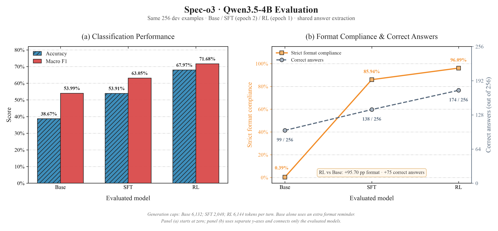
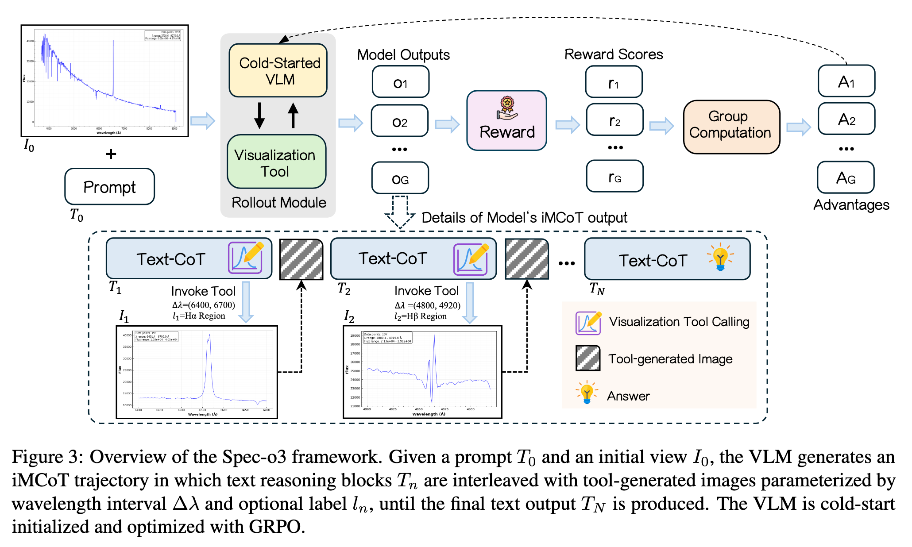
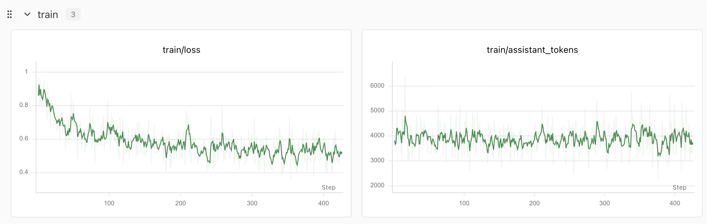
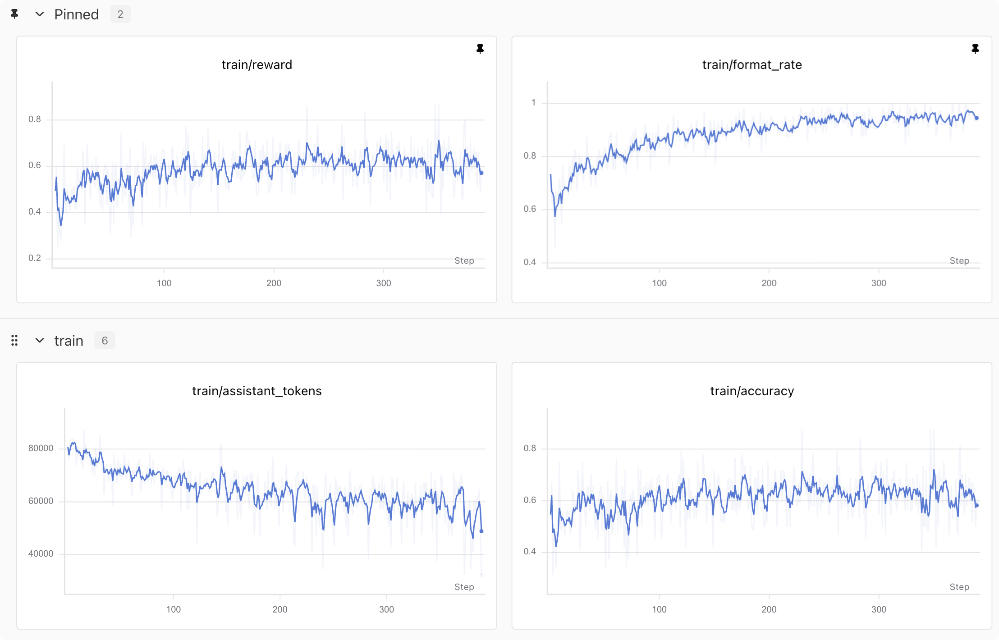
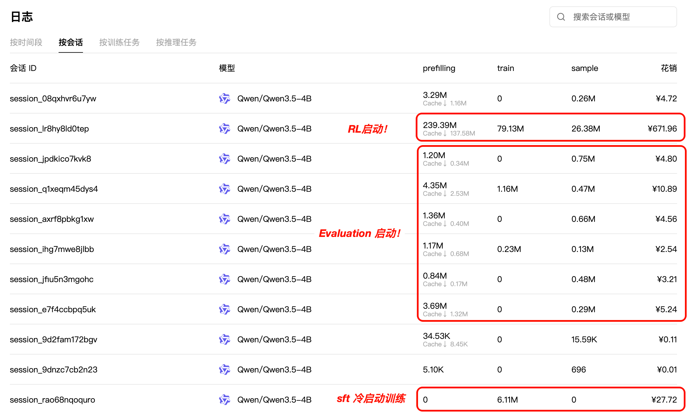

# 接下来我将复现 10 篇强化学习算法：第 9.4 篇，Spec-o3：我用 GRPO 找天上的星星 🌟

> **快速开始：** 环境准备、数据下载、SFT、RL、评测与绘图的运行命令，见 [start.md](https://github.com/KMnO4-zx/agentic-rl-lab/blob/main/09-spec-o3/start.md)。

<div align="center">
  
</div>

<div align="center">
  <a href="https://github.com/KMnO4-zx/agentic-rl-lab"></a>
  <a href="https://arxiv.org/abs/2601.06498"></a>
  <a href="https://huggingface.co/datasets/Maxwell-Jia/SpecVI-Bench"></a>
  <a href="https://docs.pytrio.com/docs"></a>
  <a href="https://www.zhihu.com/people/feng-qi-xia-pian"></a>
  <a href="https://www.xiaohongshu.com/user/profile/63c2055e000000002502c58c"></a>
  <a href="https://github.com/KMnO4-zx/agentic-rl-lab"></a>
</div>

> **代码与复现资源**
>
> - 本章实现：[SFT](https://github.com/KMnO4-zx/agentic-rl-lab/blob/main/09-spec-o3/train_sft.py) / [GRPO](https://github.com/KMnO4-zx/agentic-rl-lab/blob/main/09-spec-o3/train_rl.py) / [评测](https://github.com/KMnO4-zx/agentic-rl-lab/blob/main/09-spec-o3/eval.py) / [绘图](https://github.com/KMnO4-zx/agentic-rl-lab/blob/main/09-spec-o3/analysis.py)
> - 论文：[Spec-o3: A Tool-Augmented Vision-Language Agent for Rare Celestial Object Candidate Vetting via Automated Spectral Inspection](https://arxiv.org/abs/2601.06498)
> - 作者代码：[Maxwell-Jia/spec-o3](https://github.com/Maxwell-Jia/spec-o3)
> - 公开数据：[Cold-start SFT](https://huggingface.co/datasets/Maxwell-Jia/Spec-o3-ColdStartSFT) / [SpecVI-Bench](https://huggingface.co/datasets/Maxwell-Jia/SpecVI-Bench)
> - SwanLab：[查看本次实验公开的 SFT 与 RL 实验记录](https://swanlab.cn/@kmno4/agentic-rl-lab-spec-o3/v1/rjj3zx/runs)
> - PyTRIO：[官方文档](https://docs.pytrio.com/docs) / [多模态指南](https://docs.pytrio.com/docs/guide/vision)

这是“接下来我将复现 10 篇强化学习算法”系列的第 9.4 篇。

[Vision GRPO](https://github.com/KMnO4-zx/agentic-rl-lab/blob/main/09-vision-grpo/readme.md) 里，我们让模型看几何图做题；[ReTool](https://github.com/KMnO4-zx/agentic-rl-lab/blob/main/05-retool/readme.md) 里，我们让模型在解题过程中调用 Python。这次我想把两件事接起来：**模型一边看图、一边推理，还能主动调用工具，拿到一张新的图片继续分析。**

任务换到了天文学。给模型一张完整光谱，它需要判断这个天体是否属于某个目标类别。如果全图里的细节看不清，模型可以指定一个波长区间，让工具重新画出局部光谱，再根据新证据继续判断。

我用 Qwen3.5-4B 和 PyTRIO 跑了 **2 个 epoch 的 cold-start SFT，再接 1 个 epoch 的 GRPO**。训练、工具交互和独立评测都已经走完，下面从结果开始讲。

## 0. 先看结果：99 → 138 → 174 道题

三个模型评测的是同一批 **256 条开发集样本**。表中的 RL 指从 SFT epoch 2 权重继续训练得到的 RL epoch 1 模型；Base 指未经本任务训练的 `Qwen/Qwen3.5-4B`。

| 模型 | Macro F1 | Accuracy | Format | 答对题数 |
| --- | ---: | ---: | ---: | ---: |
| Base | 53.99% | 38.67% | 0.39% | 99 / 256 |
| SFT | 63.05% | 53.91% | 85.94% | 138 / 256 |
| **RL** | **71.68%** | **67.97%** | **96.09%** | **174 / 256** |

这里的 Macro F1 是五个任务各自正类 F1 的平均值；Accuracy 是全部 256 题中答对的比例；Format 表示轨迹是否以符合严格动作协议的最终答案结束。无法提取答案的样本在 Accuracy 中按错误计。

**比较条件需要一起看：** 三组使用相同的样本、工具和答案提取规则，总上下文上限均为 16,384 token；单轮生成上限 6,144 token，Base 还额外加了一句格式提醒。现有结果展示了三次实际评测，SFT 与 RL 的差值仍可能包含生成预算的影响。



SFT 后多答对了 39 题，严格格式合规率从 0.39% 提高到 85.94%；继续 RL 后又多答对 36 题，Macro F1 增加 8.63 个百分点，格式合规率达到 96.09%。从这一组记录看，模型的分类表现和按协议完成交互的能力都出现了改善。

Base 已经能答对部分题目，但格式遵循还不稳定。这也是本次 SFT 冷启动重点训练的能力。

## 1. Spec-o3 到底在做什么？

标题里的“找星星”，落到本章代码里，是审核一个已有候选天体的光谱是否符合目标类别。模型面对的是横轴为波长、纵轴为通量的曲线。不同波段的峰、谷和整体形状，为分类提供线索。

Spec-o3 关注大规模光谱巡天中的候选审核环节：自动筛选得到候选后，还需要检查那些容易混淆的光谱。论文把任务组织成五种独立的 YES/NO 判断，下面同时列出本地数据使用的缩写。[论文 §3–4](https://arxiv.org/html/2601.06498v1#S3)

| 本地任务名 | 目标类别 | 模型需要回答的问题 |
| --- | --- | --- |
| `cv` | 激变变星，Cataclysmic Variables | 这个候选是否符合激变变星的光谱特征？ |
| `cc` | 碳星，Carbon Stars | 这个候选是否为碳星？ |
| `ss` | S 型星，S-type Stars | 这个候选是否为 S 型星？ |
| `gm` | M 型巨星，M-type Giants | 这个候选是否为 M 型巨星？ |
| `wd` | 白矮星，White Dwarfs | 这个候选是否为白矮星？ |

每道题只询问其中一个类别。输入还带有该类别的诊断提示，例如需要关注哪些谱线、哪些形态容易混淆。模型需要把这些提示与当前图片联系起来；参考 YES/NO 标签保存在评分字段中，不进入 rollout 的输入。

以本地 CV 题目为例，提示中列出了 Hα、Hβ 等特征。模型可以先看全图，再请求工具查看 `6400–6700 Å`，随后观察另一个波段。最后返回这样的答案结构，解释也放在标签内部：

```text
<answer>\boxed{YES}这里写基于光谱观察得到的解释。</answer>
```

这就是任务最有趣的地方是：**下一张要看的图，由模型当前的判断决定。**

## 2. 交错多模态思维链：思考与新图片交替出现

Spec-o3 将这种过程称为 iMCoT，即 Interleaved Multimodal Chain-of-Thought。一次完整轨迹包含多段推理，段与段之间穿插工具返回的新图片。



*图片来源：Spec-o3 论文 Figure 3。上半部分展示组采样、奖励与 advantage；下半部分展开一条文本推理与局部光谱图交替出现的轨迹。*

在我们的实现里，一次交互按下面的顺序进行：

```text
用户问题 + 完整光谱图
→ assistant 思考，选择需要检查的波段
→ assistant 输出工具调用
→ 本地工具从光谱数组生成局部 PNG
→ tool observation 携带图片回到上下文
→ assistant 继续思考，再调用工具或输出最终答案
```

训练也分成两步。Cold-start SFT 用现成的完整轨迹示范如何观察、调用工具和作答；GRPO 则让模型在训练题上自己完成交互，按最终答案与格式获得奖励。作者公开实现的 SFT 使用 LLaMA-Factory，RL 使用 VeRL；本章把这一过程接到了 PyTRIO。[作者训练说明](https://github.com/Maxwell-Jia/spec-o3#training-pipeline)

原论文基模是 Qwen2.5-VL-3B/7B-Instruct。我们选择 Qwen3.5-4B、LoRA rank 32，所以本文属于更换基模与训练栈后的方法迁移。后面的重点是这套交互与训练过程如何实现，以及我们实际测到了什么。

### 快速开始：先把 SFT 跑起来

想先动手的读者，安装好 UV 后，可以直接执行下面的命令。首次使用时，按终端提示完成 PyTRIO 和 SwanLab 登录：

```bash
git clone https://github.com/KMnO4-zx/agentic-rl-lab.git
cd agentic-rl-lab/09-spec-o3
uv sync --locked

uv run trio login
uv run swanlab login

uv run python prepare_data.py sft
uv run python train_sft.py --epochs 2
```

这会将 SFT 数据和图片下载到 `datasets/sft/`，然后使用默认的 Qwen3.5-4B LoRA 配置启动 2 个 epoch 的冷启动训练。每轮结束后，终端会打印继续训练用的 `state_path` 和推理评测用的 `sampler_path`。

接下来可以继续阅读实现细节。数据划分、完整训练参数、如何接上 RL，以及评测和绘图命令，都放在[第 8 节：如何运行这次实验](https://github.com/KMnO4-zx/agentic-rl-lab/blob/main/09-spec-o3/readme.md#8-如何运行这次实验)。

## 3. 图片和工具调用怎样进入 PyTRIO？

### 3.1 在 Qwen3.5 的原生模板上改什么？

Qwen3.5 原生模板已经包含思考、工具调用和图片格式，也会保留同一条工具交互链中的 reasoning。我们以[固定版本的官方模板](https://huggingface.co/Qwen/Qwen3.5-4B/blob/851bf6e806efd8d0a36b00ddf55e13ccb7b8cd0a/chat_template.jinja)为底稿，整理成 [qwen3_5_spec_o3.jinja](https://github.com/KMnO4-zx/agentic-rl-lab/blob/main/09-spec-o3/templates/qwen3_5_spec_o3.jinja)，主要做两件事：

- 始终保留各轮 assistant 的 `reasoning_content`，包括跨新 user 问题的早期 reasoning，供完整轨迹监督使用。
- 用 `` 标出 assistant 需要学习的范围，让 tokenizer 返回对应的监督 mask。

原生角色头、视觉标记和 XML 工具格式继续沿用。下面是一个**格式示意**，展示一轮 assistant 怎样从思考转入工具调用：

```text
<think>
下一步检查 Hα 附近的局部光谱。
</think>
<tool_call>
<function=spectral_visualization_tool>
<parameter=wavelength_range>
[6400, 6700]
</parameter>
<parameter=label>
Hα region
</parameter>
</function>
</tool_call>
```

工具执行完，图片放进 `<tool_response>` 对应的消息，下一轮再从 assistant 的 `<think>` 前缀继续生成。模板定义了消息如何排列，SFT 则让模型通过示范学习在这些位置生成什么内容。

### 3.2 图片通过 ImageChunk 进入上下文

[protocol.py](https://github.com/KMnO4-zx/agentic-rl-lab/blob/main/09-spec-o3/protocol.py) 先渲染消息，再把每个 `<|image_pad|>` 替换为真实图片 chunk。整个输入保持文本、图片、文本的原始顺序。下面省略具体编码过程，只展示结构：

```python
prompt = trio.ModelInput(
    chunks=[
        trio.types.EncodedTextChunk(tokens=before_image_tokens),
        trio.ImageChunk(
            data=image_bytes,
            format="png",
            expected_tokens=image_tokens,
        ),
        trio.types.EncodedTextChunk(tokens=after_image_tokens),
    ],
)
```

`data` 装的是 PNG 字节；文件路径只用于本地读取。`expected_tokens` 由匹配基模的 image processor 根据图片尺寸计算，用来确定图片在序列中占多少个视觉位置。工具返回第二张、第三张图时，也按同样的方式追加。[PyTRIO 多模态指南](https://docs.pytrio.com/docs/guide/vision)

这个长度直接关系到训练对齐：一张图片占据的所有位置都要进入上下文，但对应的训练权重为零。随后 `target_tokens`、mask 等数组统一做自回归右移，保证每个位置预测的是下一个 token。

### 3.3 “放大光谱”的数据在哪里？

工具使用的是公开 Parquet 中附带的光谱数值。`prepare_data.py` 将它们提取到 `datasets/rl/spectra/*.npz`，其中保存 `wavelength`、`flux` 和 `redshift`。初始图片单独保存在 `datasets/rl/images/`。

[tools.py](https://github.com/KMnO4-zx/agentic-rl-lab/blob/main/09-spec-o3/tools.py) 的核心计算很短：

```python
wavelength = np.asarray(wavelength) / (1 + redshift)
low, high = wavelength_range
selected = (wavelength >= low) & (wavelength <= high)
ax.plot(wavelength[selected], flux[selected])
```

先做红移校正，再选中模型要求的波段，重新绘制 PNG。这样，局部图的坐标轴和显示范围会随窗口变化，模型能更清楚地观察该区间的结构。如果窗口里没有足够的数据点，工具返回文字说明，模型在下一轮继续判断。

数据里的 `.fits.gz` 名称用于标识原始光谱来源；本章工具直接读取整理好的 `.npz`。它返回的是新绘制的光谱图，以及对应的波段说明。

## 4. 先做 SFT，学会完整的交互过程

### 4.1 SFT 学的是整条轨迹

Cold-start 数据已经包含“思考、工具调用、图片观察、最终回答”。作者用诊断指南与标签辅助 GPT-5 生成初稿，再由天文学专家修订、审核，构建用于 SFT 的示范。[论文 §3.2](https://arxiv.org/html/2601.06498v1#S3.SS2)

我们下载的固定版本共有 942 条轨迹，按光谱对象划分为 **848 条训练、94 条验证**。训练读取 `sft_train.jsonl`；`train_sharegpt.json` 是保留的原始数据，`sft_stats.json` 和 `sft_cleaning.jsonl` 分别用于统计与清理记录。

公开文本里有一些损坏的科学符号。脚本修复能确定原意的编码，并把无法确定的字符保留为可见标记；当前仍有 273 条轨迹含这类标记，本次训练保留了这些轨迹。这是数据质量上的一项限制，进一步实验需要审阅这些位置。

对完整轨迹做 SFT 时，监督范围如下：

| 内容 | 是否参与 SFT loss |
| --- | --- |
| assistant 的思考、工具调用、最终答案、结束 token | 是 |
| system、user、角色头 | 否 |
| 工具返回的文字和图片 | 否 |

模型要学习的是如何根据已有观察生成下一段思考和动作。工具图片仍然可见，它们会影响后续预测；训练目标集中在 assistant 生成的 token 上。

### 4.2 SFT 冷启动环节

在进入 RL 之前，我们先通过 SFT 冷启动，让 Qwen3.5-4B 学习**交错思维链和工具调用的格式**。模型需要先生成一段思考，在需要进一步观察时输出符合协议的工具调用；收到工具返回的局部光谱图后，再接着思考，直到给出最终答案。

完整示范轨迹把这些环节连在一起：`<think>` 中写分析，`<tool_call>` 中指定工具和波长区间，工具观察回填后开启下一轮思考，最后用 `<answer>` 包住结论与解释。SFT 对各轮 assistant 的输出进行监督，让模型学习如何按这套协议组织分析和动作，为后续 GRPO 的多轮探索打下基础。

训练由 [train_sft.py](https://github.com/KMnO4-zx/agentic-rl-lab/blob/main/09-spec-o3/train_sft.py) 异步执行，使用 `cross_entropy`，只监督 assistant 生成的内容。实际配置是 batch size 4、学习率 `2e-5`、LoRA rank 32、2 个 epoch，共 **424 个训练 step**。每轮结束后计算验证 loss，并保存供后续训练和评测使用的权重。



完整训练曲线与实验配置已公开，可在 [SwanLab 实验列表](https://swanlab.cn/@kmno4/agentic-rl-lab-spec-o3/v1/rjj3zx/runs)中查看 SFT 记录。

图里的平滑训练 loss 从约 0.9 降到约 0.5。对应的 SFT 模型在开发集上答对了 **138 / 256** 道题，严格格式合规率达到 **85.94%**。完成这一轮冷启动后，我们再接上 GRPO，让模型通过实际工具交互和最终奖励，继续改进波段选择与分类判断。


## 5. 再做 GRPO，让模型在交互中学习

### 5.1 一道题采样 8 条，各自把工具流程走完

RL 使用 `datasets/rl/bench_rl_train.jsonl` 中的 **3,108 道题**。每个 batch 取 8 道题，每题生成 8 条轨迹，所以正常一批有 64 条 rollout。

同一道题的第一轮输入完全相同，可以用一次请求取得 8 个开头：

```python
first_turn = await sampler.sample_async(
    prompt=prompt,
    num_samples=args.group_size,
    sampling_params=sampling_params,
)
```

后面各条轨迹可能选择不同波段，得到的工具图片也不同，因此分别带着自己的上下文，用 `num_samples=1` 继续生成。同一道题始终维护这 8 条轨迹，已经完成的分支停止请求。不同题目和分支通过 `asyncio.gather()` 并发执行。

整批 rollout 共用同一版 sampler，全部完成后才更新模型；下一批再从更新后的权重创建 sampler。这样，组内比较的 reward 和采样时保存的 old logprob 都对应同一版策略。

一个 epoch 会生成 `3,108 × 8 = 24,864` 条轨迹，经过 **389 个 rollout batch**，最后一批为 4 道题、32 条轨迹。终端总进度条按轨迹计数，内层进度条展示当前 batch 的完成情况。实际 optimizer 更新次数还要看是否存在整批都没有有效相对信号的情况。

### 5.2 奖励只看答案与格式

本章的奖励写成：

$$
r(\tau)=\mathbb{1}[\text{答案正确}]-0.2\,\mathbb{1}[\text{格式错误}]
$$

| 答案 | 格式 | Reward |
| --- | --- | ---: |
| 正确 | 合格 | 1.0 |
| 正确 | 不合格 | 0.8 |
| 错误 | 合格 | 0.0 |
| 错误 | 不合格 | -0.2 |

没有额外的工具调用次数奖励。模型是否值得再看一张图，要通过最终任务结果获得学习信号。

训练奖励的答案提取只读取最后一轮思考结束后、正文开头的 YES/NO，允许缺少部分标签的答案获得正确性分数。评测则从最后一轮最后一个 `</think>` 之后提取最后一个完整 answer 块；两者分别实现。

### 5.3 有组内差异，才有相对学习信号

同一题的 8 条轨迹按 reward 计算 advantage：

$$
A_i=\frac{r_i-\operatorname{mean}(r_1,\ldots,r_8)}{\operatorname{std}(r_1,\ldots,r_8)+10^{-6}}
$$

标准差使用样本标准差，即 `ddof=1`。即使答错只得 0 分，当同组其他轨迹获得更高 reward 时，这条轨迹仍会得到负 advantage。

**跳过的条件是整组 reward 完全相同。** 由于格式也影响 reward，即使整组都答对，也可能因格式不同而产生学习信号。被跳过的组仍计入训练统计；当前代码不重新补采样来填满有效组。

### 5.4 只更新实际生成的 assistant token

[rollout.py](https://github.com/KMnO4-zx/agentic-rl-lab/blob/main/09-spec-o3/rollout.py) 每轮直接保存服务返回的 token 和 logprob。续写时保留实际生成的历史，仅编码新增的工具观察与下一轮前缀，避免重新渲染 assistant 文本后改变 token 序列。

一条轨迹中的 assistant token 共享该轨迹的 advantage。问题、图片、工具观察和程序补入的分隔符只作为上下文，对应的 advantage 为零。随后整批 Datum 交给 PyTRIO 内置 `ppo` loss，裁剪范围为 `[0.8, 1.2]`，每批更新一次。



完整 RL 曲线与实验配置同样保存在公开的 [SwanLab 实验列表](https://swanlab.cn/@kmno4/agentic-rl-lab-spec-o3/v1/rjj3zx/runs)中。

训练曲线里，格式合规率上升比较明显，后段接近 0.95；reward 和训练正确率则在波动中改善，后半段没有持续单调上升。每个 step 遇到的题目不同，所以这些曲线用于观察训练过程，最终表现仍回到固定开发集评测。

左下角的 `train/assistant_tokens` 是**当前整批有效训练样本的 token 总数**，同时受轨迹长度、同分组跳过和尾批大小影响。若要判断平均推理是否变短，应查看逐轨迹长度或 `rollout/mean_generated_tokens`。

## 6. SFT 冷启动为什么重要？

这次实验中，Base 能给出部分正确判断，但严格格式合规率只有 **0.39%**；SFT 后达到 **85.94%**。这个变化让我直观地看到，完整轨迹示范对模型遵循交互协议很有帮助。

SFT 让模型学习“**思考 → 工具调用 → 图片观察 → 继续思考 → 最终回答**”的交错结构：怎样按格式指定工具参数，怎样在收到新图片后继续分析，以及怎样规范地结束回答。这些能力共同支撑了一条可执行的多轮轨迹。

有了这层冷启动，后续 GRPO 就能在模型已经熟悉的交互流程上，通过最终奖励继续优化波段选择和分类判断。

## 7. PyTRIO 给科研带来的价值

原论文使用 **8 张 NVIDIA H100** 完成训练。[论文 §4.2](https://arxiv.org/html/2601.06498v1#S4.SS2) 对想尝试这类研究的人来说，准备算力、部署多卡训练环境、衔接训练和推理，本身就需要投入不少精力。这次我通过 PyTRIO，用 Qwen3.5-4B LoRA 跑通了 SFT、工具交互和 GRPO，模型计算与权重存储都交给远程服务。

这套方式对科研的价值，在实验推进过程中很具体：

- **更快启动一个想法。** 准备好数据和 Python 训练循环，就能通过 API 提交计算。本地负责光谱绘图、消息组织和奖励计算，多卡训练的执行由服务端处理，普通 CPU 机器也能作为实验入口。[PyTRIO 介绍](https://docs.pytrio.com/docs)
- **更方便并行做对照实验。** 后续比较不同学习率、奖励设置或随机种子时，可以分别创建训练任务，同时推进多组实验。各任务的 LoRA 权重和优化器状态独立，由服务端调度共享算力，实验组织不必与某一台 GPU 服务器绑定。[多作业调度说明](https://docs.pytrio.com/docs/clock-cycle)
- **把时间留给研究问题。** 这次我主要处理的是交错思维链、图文输入、工具观察、reward 和评测规则。修改这些逻辑后，可以继续沿用已有的训练接口、checkpoint 和 SwanLab 记录，逐步验证自己的判断。

本次的实际用量也保留在下面。两个训练会话合计 **¥699.68**，评测与调试会话另计；这里记录的是 Qwen3.5-4B LoRA 实验，与原论文的模型和训练配置不同。



截图中明确标注的两个训练会话如下，M 表示百万 token：

| 会话 | Prefilling | Train | Sample | 费用 |
| --- | ---: | ---: | ---: | ---: |
| SFT 冷启动 | 0 | 6.11M | 0 | ¥27.72 |
| RL | 239.39M | 79.13M | 26.38M | ¥671.96 |
| **这两个训练会话合计** | | | | **¥699.68** |

这次从看论文到完成实验，我只花了**不到一天的时间**。

PyTRIO 最有价值的地方，在与**缩短了从“我想试试这个方法”到“我拿到了可以分析和比较的结果”之间的距离**。先把一个想法跑起来，再增加对照、检查失败轨迹、调整训练方案，这样的迭代节奏对科研很重要。

## 8. 如何运行这次实验？

### 8.1 安装环境并登录

在已安装 UV 的机器上，先获取项目并安装锁定依赖：

```bash
git clone https://github.com/KMnO4-zx/agentic-rl-lab.git
cd agentic-rl-lab
uv sync --locked
cd 09-spec-o3

uv run trio login
uv run swanlab login
```

已有项目可直接在根目录执行 `uv sync --locked`，再进入 `09-spec-o3/`。**下面所有命令都在这个目录运行。** 项目使用 Python 3.13+、PyTRIO 0.2.9；本地负责数据处理、绘图和训练调度，模型训练与采样由远程服务执行。训练所需的认证使用 CLI 保存的登录信息。

### 8.2 先准备 SFT，再准备 RL 数据

```bash
uv run python prepare_data.py sft
uv run python prepare_data.py bench
```

这个顺序有实际依赖：`bench` 会读取 SFT 的对象列表，避免把 SFT 出现过的光谱分进 dev。下载的数据、图片和整理结果分别保存在：

```text
datasets/
├── sft/
│   ├── train_sharegpt.json
│   ├── images/
│   ├── sft_train.jsonl       # 848 条，用于 SFT
│   ├── sft_val.jsonl         # 94 条，用于验证 loss
│   ├── sft_cleaning.jsonl
│   └── sft_stats.json
└── rl/
    ├── data/                 # 下载的原始 Parquet
    ├── images/               # 初始光谱图片
    ├── spectra/              # 工具使用的 NPZ 数组
    ├── bench_rl_train.jsonl  # 3,108 条，用于 RL
    ├── bench_dev.jsonl       # 256 条，本章评测集
    ├── bench_test.jsonl      # 6,754 条，尚未评测
    └── bench_stats.json
```

脚本使用固定数据 revision，直接下载到上述目录。当前下载设置为 Hugging Face 官方 HTTP 通道并关闭 Xet，重新执行会复用已完成文件。JSONL 中保存的是图片和光谱的绝对路径；迁移目录或机器后，需要重新整理以更新路径。

### 8.3 运行 2 个 epoch 的 SFT

```bash
uv run python train_sft.py \
    --base-model Qwen/Qwen3.5-4B \
    --epochs 2 \
    --batch-size 4 \
    --rank 32 \
    --learning-rate 2e-5 \
    --run-name spec-o3-sft \
    --swanlab-mode online
```

脚本默认只训练 1 个 epoch，因此这里显式传入 `--epochs 2`。`--model-revision` 默认是 `main`，本次 SFT 记录也使用了这一设置；需要固定 tokenizer 与 image processor 文件时，可传入本章数据准备和评测使用的 `851bf6e806efd8d0a36b00ddf55e13ccb7b8cd0a`。

训练结束后，保留 epoch 2 对应的 `state_path` 和 `sampler_path`。它们分别用于下一步 RL 和 SFT 模型评测。

### 8.4 从 SFT state 接着训练 RL

把下面的占位符替换成 **PyTRIO 权重控制台获取或训练终端打印的 state_path**：

```bash
uv run python train_rl.py \
    --state-path '<SFT epoch 2 的 state_path>' \
    --epochs 1 \
    --batch-size 8 \
    --group-size 8 \
    --learning-rate 1e-6 \
    --max-turns 8 \
    --max-tokens 2048 \
    --max-seq-len 16384 \
    --save-every 100 \
    --run-name spec-o3-rl \
    --swanlab-mode online
```

`--max-tokens` 限制单次生成长度；`--max-seq-len` 限制包含文字、图片与工具历史的总上下文。`--max-turns 8` 是最多 8 轮 assistant 生成，最终答案也占一轮；当前实现最多执行前 7 轮的工具调用。

当前脚本每 100 个累计 rollout step 保存一次 state 和 sampler，epoch 结束时也保存。这个周期保存功能是在首次 RL 实验之后补上的，便于后续运行时保留中间权重。训练日志里同时记录 rollout step 与实际 updates，两者在跳过整批更新时会有差别。

作者公开配置与本次实际训练有以下主要差异：

| 项目 | 作者公开配置 | 本次实验 |
| --- | --- | --- |
| 基模 | Qwen2.5-VL-3B/7B-Instruct | Qwen3.5-4B |
| 参数更新 | SFT 配置为语言模型全参数更新，冻结视觉部分 | LoRA rank 32 |
| SFT / RL epoch | 5 / 3 | 2 / 1 |
| SFT / RL 学习率 | `2e-5` / `1e-6` | `2e-5` / `1e-6` |
| SFT 调度 | cosine，warmup ratio 0.05 | 恒定学习率 |
| RL 每批题目数 / 每题轨迹数 | 64 / 8 | 8 / 8 |
| 序列预算 | SFT cutoff 32,768；RL max response 32,768 | 训练轨迹按 16,384 总上下文安排 |

作者参数来自固定提交的 [SFT YAML](https://github.com/Maxwell-Jia/spec-o3/blob/dd6eb9130d9d850cd67b2a6c55e651da08ab28cb/cold_start/examples/spec_o3/qwen2_5_sft_full.yaml) 与 [RL YAML](https://github.com/Maxwell-Jia/spec-o3/blob/dd6eb9130d9d850cd67b2a6c55e651da08ab28cb/reinforcement_learning/recipe/spec_o3/configs/spec_o3.yaml)。本章也未逐项复刻上游 loss 的全部细节，因此这些结果用于观察本地方法迁移，不能直接与论文榜单数值对齐。

### 8.5 评测 Base、SFT 和 RL

下面保留开头结果表对应的生成预算。将占位符替换成各自的 **sampler_path**：

```bash
# Base：不传 model-path，脚本自动追加格式提醒。
uv run python eval.py \
    --output outputs/base-dev \
    --max-tokens 6132 \
    --max-seq-len 16384

# SFT epoch 2。
uv run python eval.py \
    --model-path '<SFT epoch 2 的 sampler_path>' \
    --output outputs/sft-dev \
    --max-tokens 2048 \
    --max-seq-len 16384

# SFT → RL epoch 1。
uv run python eval.py \
    --model-path '<RL epoch 1 的 sampler_path>' \
    --output outputs/sft-rl \
    --max-tokens 6144 \
    --max-seq-len 16384
```

`--output` 是评测产物目录，会保存 `metrics.json`、逐样本的 `trajectories.jsonl` 和工具生成的图片。重新评测时换一个目录名，可以保留旧记录。评测默认使用 `bench_dev.jsonl`、并发 16、temperature 0.6、seed 42、最多 8 轮。

本次 Base 与 SFT 的表格数值来自已有轨迹重算后的 `metrics-reparsed.json`，RL 来自新规则下的 `metrics.json`。当前 `eval.py` 已包含新提取规则，重新运行会直接写入 `metrics.json`。

要补齐 SFT 与 RL 的生成预算对照，下一次执行：

```bash
uv run python eval.py \
    --model-path '<SFT epoch 2 的 sampler_path>' \
    --output outputs/sft-dev-6144 \
    --max-tokens 6144 \
    --max-seq-len 16384
```

这是待完成的同预算复测，结果尚未包含在本文表格中。

### 8.6 绘图与代码阅读顺序

```bash
uv run python analysis.py
```

脚本将本文的固定结果绘制为 `images/results_comparison.png`，并导出同名矢量 PDF。它不读取新的评测目录；后续得到新结果时，需要同步更新脚本中的数据和图注。

代码阅读可以从数据准备开始，沿着输入、工具交互和训练向下走：

| 文件 | 职责 |
| --- | --- |
| [prepare_data.py](https://github.com/KMnO4-zx/agentic-rl-lab/blob/main/09-spec-o3/prepare_data.py) | 下载、清理和划分数据，保存图片与光谱数组 |
| [templates/qwen3_5_spec_o3.jinja](https://github.com/KMnO4-zx/agentic-rl-lab/blob/main/09-spec-o3/templates/qwen3_5_spec_o3.jinja) | 渲染多轮图文消息，标出 assistant 监督区间 |
| [protocol.py](https://github.com/KMnO4-zx/agentic-rl-lab/blob/main/09-spec-o3/protocol.py) | 构造图片 chunk、SFT/RL Datum，解析动作 |
| [tools.py](https://github.com/KMnO4-zx/agentic-rl-lab/blob/main/09-spec-o3/tools.py) | 按波长区间重绘局部光谱 |
| [rollout.py](https://github.com/KMnO4-zx/agentic-rl-lab/blob/main/09-spec-o3/rollout.py) | 执行一条完整工具轨迹，保存实际 token 与 logprob |
| [train_sft.py](https://github.com/KMnO4-zx/agentic-rl-lab/blob/main/09-spec-o3/train_sft.py) | 异步 SFT、验证和两份权重保存 |
| [train_rl.py](https://github.com/KMnO4-zx/agentic-rl-lab/blob/main/09-spec-o3/train_rl.py) | 组采样、奖励、advantage、PPO 更新与 checkpoint |
| [eval.py](https://github.com/KMnO4-zx/agentic-rl-lab/blob/main/09-spec-o3/eval.py) | 独立评测，保存分类指标、轨迹和工具图片 |
| [analysis.py](https://github.com/KMnO4-zx/agentic-rl-lab/blob/main/09-spec-o3/analysis.py) | 绘制本文的固定结果 |
