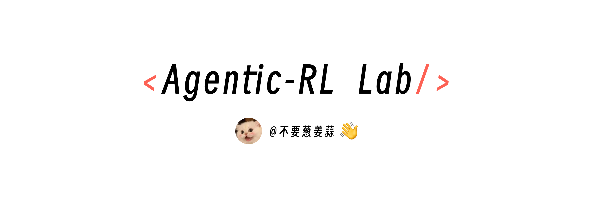
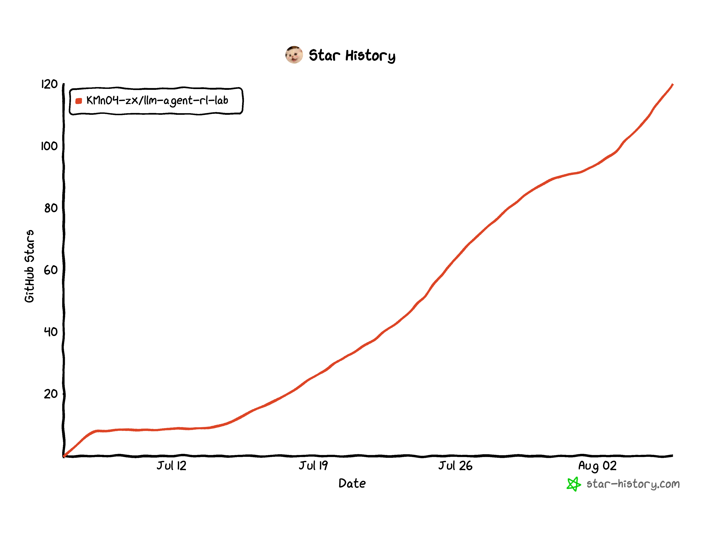

<div align="center">

<a href="https://github.com/KMnO4-zx/agentic-rl-lab">
  
</a>

<h1><i>Agentic-RL Lab</i></h1>

<p>
  <strong>中文</strong> | <a href="./README_EN.md">English</a>
</p>

<p>
  复现和拆解前沿 LLM 强化学习算法，用更简单的代码和更低的 GPU 门槛，把 GRPO、OPD、OPSD、GSPO、DAPO、Search-R1、ReTool、ALFWorld、Slime 等方法跑起来，方便复现。
</p>

<p>
  <a href="https://pytrio.cn/"></a>
  <a href="https://swanlab.cn/"></a>
  <a href="https://swanlab.cn/@kmno4/llm-agent-rl-lab/overview"></a>
  <a href="https://www.zhihu.com/people/feng-qi-xia-pian"></a>
  <a href="https://www.xiaohongshu.com/user/profile/63c2055e000000002502c58c"></a>
  <a href="https://github.com/KMnO4-zx/agentic-rl-lab"></a>
  
</p>

</div>

<p align="center">
  💬 <strong>微信交流群：</strong>
  <a href="https://github.com/KMnO4-zx/agentic-rl-lab/issues/13">点击查看群二维码</a>
</p>

## 项目介绍

&emsp;&emsp;这是一个偏实验记录和教程的仓库。我会用 [PyTRIO](https://pytrio.com) 复现一组和 LLM / Agent RL 相关的强化学习算法，主要做三件事：

1. 先把算法讲明白：它从哪篇论文来，解决什么问题，核心变量是什么。
2. 再用可运行代码复现：数据、reward、loss、训练循环、SwanLab 记录都放在仓库里。
3. 可能未来会做一个更友好和轻量的 Agent RL 训练框架～
4. ***第十篇，我会做 Harness-RL 的复现和拆解。***

> *&emsp;&emsp;选择 PyTRIO 的原因很简单，我曾很想要深度研究一下 Agentic-RL 算法，但一直受一些阻力困扰。比如：没卡、训推一体的代码复杂度、Verl 的高耦合工程代码等等。让我一直迟迟没有动手研究。PyTRIO 的出现，让我可以用更简单的代码和更低的门槛来研究 Agentic-RL 算法。仓库的全部内容我仅仅花了不到一个月时间就全部学习和复现完了。*

> *&emsp;&emsp;我认为 PyTrio 或 Tinker 这类产品是面向未来的大模型后训练基础设施，早一点接触对算法工程师或是 Researcher 而言都是很有价值的。*

## 文章目录

| 篇章 | 主题 | 内容 |
| --- | --- | --- |
| [第 0 篇](./00-loss-function/readme.md) | Loss Function | 用直觉解释 `importance_sampling`、`ppo`、`cispo` 分别在优化什么 |
| [第 1 篇](./01-grpo/readme.md) | GRPO | 复现 GSM8K 上的 GRPO，并比较 `importance_sampling` / `ppo` / `cispo` 三个 loss |
| [第 2 篇](./02-opd/general-opd/readme.md) | General OPD | 用 DeepMath-103K 跑通 Student 采样、Teacher 打分与 reverse KL 的最小闭环 |
| [第 2 篇](./02-opd/readme.md) | Medical OPD | 从 Medical SFT 出发，用 SAR-OPD 和 IDT-OPD 增强医疗能力，同时保持通用能力 |
| [第 3 篇](./03-search-r1/readme.md) | Search-R1 | 用 Qwen3.5-4B、PyTRIO 和可切换的在线搜索后端复现多轮搜索 RL |
| [第 4 篇](./04-opsd/readme.md) | OPSD | 用固定的 step-0 Teacher 蒸馏 Student 自采样轨迹 |
| [第 5 篇](./05-retool/readme.md) | ReTool | 用 Qwen3.5-4B、PyTRIO 和本地代码沙箱复现代码交织的 Agentic RL |
| [第 6 篇](./06-dapo/readme.md) | DAPO | 拆解四项核心改进，并记录 Dynamic Sampling 在真实训练中的时间成本 |
| [第 7 篇](./07-gspo/readme.md) | GSPO | 将重要性比率与裁剪从 token 级提升到 sequence 级 |
| [第 8 篇](./08-alfworld/readme.md) | ALFWorld | 用 12K 长轨迹、真实 TextWorld 环境和 group-relative advantage 训练家务 Agent |

## 快速启动

&emsp;&emsp;如果是直接 clone 这个仓库：

```bash
git clone https://github.com/KMnO4-zx/agentic-rl-lab.git
cd agentic-rl-lab
uv sync
```

&emsp;&emsp;运行第 8 篇 ALFWorld 时，需要额外安装 TextWorld 环境依赖：

```bash
uv sync --extra alfworld
```

&emsp;&emsp;如果只想把某个 demo 脚本拎到自己的项目里跑，当前基础依赖为：

```bash
uv add \
  "datasets>=5.0.0" \
  "math-verify>=0.9.0" \
  "matplotlib>=3.11.0" \
  "modelscope>=1.38.1" \
  "numpy>=2.5.1" \
  "openai>=2.44.0" \
  "python-dotenv>=1.2.2" \
  "pytrio==0.2.6" \
  "swanlab==0.9.2" \
  "torch>=2.9.1" \
  "tqdm>=4.68.3"
```

&emsp;&emsp;Search-R1 的 DeepSeek Search 后端使用固定源码版本：

```bash
uv add "deepseek-search @ git+https://github.com/KMnO4-zx/deepseek-search.git@6215c8dbb7347f94e9dcea6e741df5918449d6c4"
```

&emsp;&emsp;ALFWorld 的 optional extra 对应：

```bash
uv add --optional alfworld "alfworld==0.4.2" "spacy==3.8.13"
```

## Star History

<div align="center">
  
</div>

## Contributor

<div align=center style="margin-top: 30px;">
  <a href="https://github.com/KMnO4-zx/agentic-rl-lab/graphs/contributors">
    
  </a>
</div>

## License

See [LICENSE](./LICENSE).
